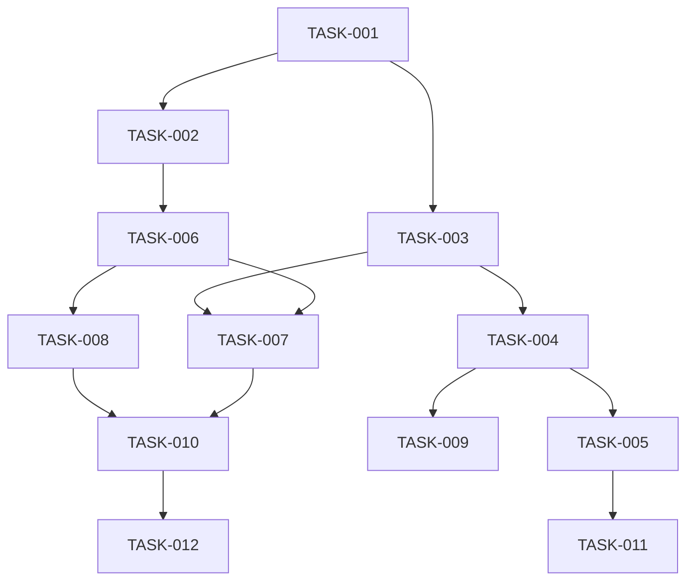

# Project Tasks Tracking

## Status Markers
- ?? Not Started
- ?? In Progress
- ?? Completed
- ? Blocked
- ?? Need Review

## Priority Levels
- P0: Critical path, must be completed first
- P1: High priority, important for core functionality
- P2: Medium priority, enhances functionality
- P3: Low priority, nice to have

## Core System Development

### Phase 1: Foundation (P0)
- ?? [TASK-001] Project Setup
  - ?? Initialize Next.js project with TypeScript
  - ?? Setup ESLint and Prettier
  - ?? Configure build system
  - ?? Setup testing framework

- ?? [TASK-002] File System Storage
  - ?? Design file structure
  - ?? Implement FileStore class
  - ?? Add concurrency handling
  - ?? Write unit tests

- ?? [TASK-003] Content Management
  - ?? Create ContentManager interface
  - ?? Implement MDX processing
  - ?? Add metadata handling
  - ?? Setup content validation

### Phase 2: Core Features (P1)
- ?? [TASK-004] Basic UI Components
  - ?? Create PostList component
  - ?? Create PostView component
  - ?? Implement responsive layout
  - ?? Add basic styling

- ?? [TASK-005] Routing and Navigation
  - ?? Setup dynamic routes
  - ?? Implement pagination
  - ?? Add breadcrumb navigation
  - ?? Create 404 handling

- ?? [TASK-006] Cache System
  - ?? Design cache structure
  - ?? Implement cache manager
  - ?? Add cache invalidation
  - ?? Setup cache monitoring

### Phase 3: Enhancement (P2)
- ?? [TASK-007] Search Functionality
  - ?? Implement search index
  - ?? Create search API
  - ?? Add search UI
  - ?? Optimize search performance

- ?? [TASK-008] Plugin System
  - ?? Design plugin architecture
  - ?? Create plugin manager
  - ?? Implement hook system
  - ?? Add plugin documentation

- ?? [TASK-009] Theme System
  - ?? Create theme interface
  - ?? Implement theme manager
  - ?? Add default theme
  - ?? Create theme documentation

### Phase 4: Polish (P3)
- ?? [TASK-010] Admin Interface
  - ?? Create admin dashboard
  - ?? Add content editor
  - ?? Implement media manager
  - ?? Add user management

- ?? [TASK-011] SEO Optimization
  - ?? Add meta tags management
  - ?? Create sitemap generator
  - ?? Implement RSS feed
  - ?? Add structured data

- ?? [TASK-012] Documentation
  - ?? Write user guide
  - ?? Create API documentation
  - ?? Add deployment guide
  - ?? Create contribution guide

## Dependencies

## Progress Tracking

### Current Focus
- [TASK-001] Project Setup

### Blocked Tasks
None

### Next Up
- [TASK-002] File System Storage
- [TASK-003] Content Management

### Recently Completed
None

## Updates

### 2024-12-07
- Created initial task tracking document
- Defined project phases and priorities
- Established dependency relationships
